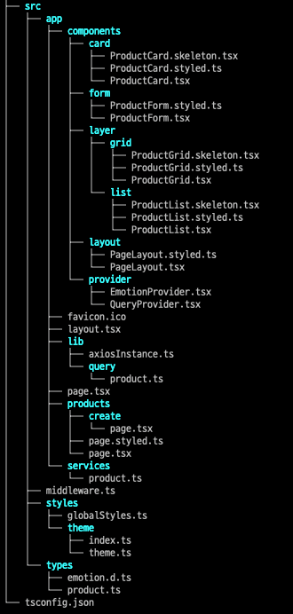

# 🛍️ Product Panel

상품 목록을 **Grid/List 뷰**로 전환하고, 제품을 생성할 수 있는 웹 패널입니다.  
`Next.js App Router`, `React Hook Form`, `Emotion`, `React Query`, `Yup` 등을 사용해 클라이언트 및 서버 사이드 렌더링을 구성했습니다.

---

## 🚀 기술 스택

- **Framework:** [Next.js 15](https://nextjs.org/) (App Router)
- **UI Styling:** [@emotion](https://emotion.sh/docs/introduction)
- **Form Handling:** [React Hook Form](https://react-hook-form.com/)
- **Data Fetching & Caching:** [@tanstack/react-query](https://tanstack.com/query/v5)
- **Type System:** TypeScript

---

## Getting Started

```bash
# 의존성 설치
pnpm install

# 개발 서버 실행
pnpm dev
```

---

## 📁 폴더 구조

## 

---

## 🧠 주요 로직

## 📌 주요 로직

### 1. 랜덤 뷰 선택 (Grid/List)

- `/products` 페이지 접근 시, 사용자는 **24시간 동안 유지되는 랜덤 뷰(Grid 또는 List)** 를 할당받습니다.
- 이 뷰 모드는 **Next.js의 `middleware.ts`**를 사용하여 **서버 진입 전 쿠키에 설정**됩니다.
- 쿠키에 저장된 값은 서버 컴포넌트에서 읽혀, `ProductGrid` 또는 `ProductList` 중 하나가 조건부 렌더링됩니다.

#### ✅ 왜 `middleware.ts`를 사용했는가?

| 목적                               | 설명                                                                   |
| ---------------------------------- | ---------------------------------------------------------------------- |
| **서버 진입 전 쿠키 처리**         | 클라이언트가 페이지에 진입하기 전에 쿠키를 생성 및 갱신할 수 있음      |
| **렌더링 방식 결정의 일관성 보장** | 클라이언트와 서버 모두 동일한 쿠키 기반으로 뷰 모드 결정 가능          |
| **경량 처리 (Edge Function)**      | 빠른 실행, 별도 API 호출 없이 쿠키 설정 가능                           |
| **SSR 이전 실행 보장**             | 서버 컴포넌트에서 안전하게 쿠키 값에 접근 가능 (`cookies()` 사용 가능) |

```ts
// 예시: middleware.ts
if (!cookie || 만료됨) {
  const view = Math.random() < 0.5 ? "grid" : "list";
  response.cookies.set("render", `${view}|timestamp`);
}
```

### 2. 제품 생성 (ProductForm)

- `react-hook-form`으로 구성된 제품 생성 폼
- 실시간 할인 계산 (가격 \* (1 - 할인율 / 100))
- submit 시 router.push('/products')
